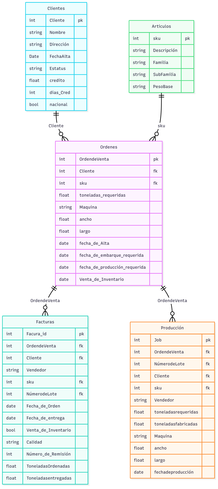

# Tarea 3
## Diagrama ER
 
## Operaciones de Algebra relacional 

- En el primer ejemplo tenemos una selección de clientes nacionales 
    * σ(nacional = true)(Clientes) 
- En este segundo ejemplo tenemos todas las ordenes de más de 10 toneladas requeridas   
    * σ(toneladas_requeridas > 10)(Ordenes)
- Selecciopn de sku y Descripción
    * π(sku, Descripción)(Artículos)